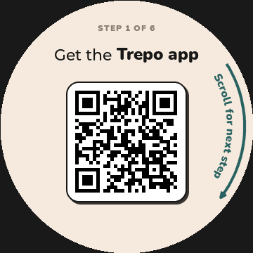
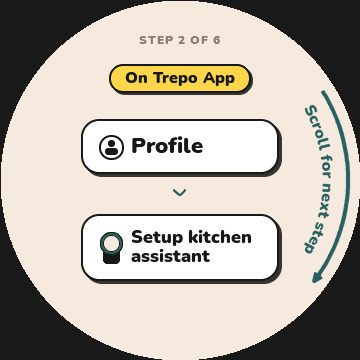

# Provisioning readability — September 21, 2026

Published in paired firmware 200 on September 21. User manual installation is pending; installed 199 acceptance is retained separately. [Release identity and limits](PROVISIONING_UI_RELEASE_200.md). The iteration records below describe their original pre-release validation.

- Enlarge “Scroll for next step” from 12 to 16 px (33%). Extend the single downward arrow around the outside of the full text arc, with a 4 px stroke and one arrowhead below the final word. Retain centered page content and existing scroll behavior.
- Change the step 2 Profile badge from yellow to white, retaining the dark filled person and circular dark outline. The app reference is `Desktop/Apps/trepo-ios-codex/trepo_v0/trepo_v0/MainTabView.swift`, lines 95–103: `person.fill` on a white circular button. Only this setup badge changes; the yellow “On Trepo App” pill retains its existing appearance.
- Replace the step 2 kitchen assistant Wi-Fi symbol with the app’s custom device illustration: dark rounded body, teal dial and cream screen, matching `HaloDeviceIcon` in a 24×34 footprint.
- Regenerate the checked-in alpha mask with the same Nunito Black font. Mask data grows from 6,916 to 9,118 bytes of static flash; no new UI object, font or animation is added.

## Validation

Actual LVGL 8.3 rendering of both production page branches, real fonts and QR widget: no cue/content overlap or circular clipping; minimum cue-to-rim clearance 7.466 px. Existing Profile callback test passed, including its missing-person negative control and repeated redraw allocation check. All 104 offline regression suites passed with no skipped cases. Source stayed unchanged during that gate; this documentation and the preview PNGs were added afterward. No physical-panel or new firmware-build qualification is claimed.

Evidence: `/Users/MattTaylor/halo-provision-readability-20260921/` contains `profile-render001`, `render-tools/page-renders/RESULT.json` and `regression001/RESULT.json`.

Initial readability regression result SHA-256: `48534b75b52a3d3724f633c4fa6cdb51f51a119125a80c839abe432d225c1946`.

Future releases must include these source changes on top of 199 and use the existing canonical build/publication workflow with an unused version 200 or later. Existing release metadata continues to describe the published bytes, not this pending UI change.

## Arrow thickness follow-up

The regenerated asset changes only the lower arrow pixels (x276–315, y279–318); all text pixels are identical. Both actual LVGL page renders again pass overlap/clipping checks, and all 104 offline suites pass on the updated source. This intermediate revision used a short 4 px arrow; the previews above show the latest full-length revision described below. No firmware was built, installed or published.

Evidence: `/Users/MattTaylor/halo-provision-arrow-20260921/asset-diff.json`, `regression001/RESULT.json`, and `/Users/MattTaylor/halo-provision-readability-20260921/render-tools/arrow-renders/RESULT.json`.

Arrow follow-up regression SHA-256: `b47cfff860b48c013727f484186695a6e847ce08597c8f805044da5e248c956d`.

## Full-length curved arrow follow-up

The arrow now follows the outside of the entire text arc, starting just above the first word and ending below the last word with one downward arrowhead. The 4 px stroke remains. Text pixels are unchanged; all asset differences are outside radius 162 px. Both actual LVGL pages pass overlap/clipping checks, with 7.466 px minimum rim clearance. All 104 offline suites pass on this updated source. Documentation and current previews were updated after the gate. No device installation, firmware build or publication occurred.

Evidence: `/Users/MattTaylor/halo-provision-wrap-20260921/asset-diff.json`, `regression001/RESULT.json`, and `/Users/MattTaylor/halo-provision-readability-20260921/render-tools/wrap-renders/RESULT.json`.

Full-length arrow regression SHA-256: `0df2b760ef20f69e20dc8249b4589812655ef9b44b3a60aebed843fd8d5a6702`.

## Kitchen assistant icon follow-up

The current iOS Profile entry uses a custom `HaloDeviceIcon`, rather than a generic Wi-Fi symbol. Port its normalized 34×48 shape coordinates and existing palette into a direct LVGL draw callback for the step 2 route card. The 24×34 icon replaces the previous single icon object, with no bitmap, font or child-object allocations. The current app reference is `/Users/MattTaylor/Desktop/Apps/trepo-ios-codex/trepo_v0/trepo_v0/HaloDeviceIcon.swift` and `ProfileView.swift` (iconTile); source hashes are retained in the evidence below. The older iOS checkout’s router icon is not the current reference.

Actual LVGL rendering passed direct ring/screen/body color checks and visual comparison with the native app screenshot. Both guide pages have no cue/content overlap or circular clipping. Fifty redraws of each page produce identical pixels and retain zero additional heap bytes. All 104 offline regression suites passed. Documentation and the current preview were updated after the gate. No firmware build, device installation or publication occurred.

Evidence: `/Users/MattTaylor/halo-provision-assistant-icon-20260921/app-reference.json`, `regression001/RESULT.json`, and `/Users/MattTaylor/halo-provision-readability-20260921/render-tools/assistant-renders/RESULT.json`.

Assistant icon regression SHA-256: `07c73b8babc99b7b6e0ff75de162a4ed1b52e5df155bd2f2c269ee88eeb11285`.
